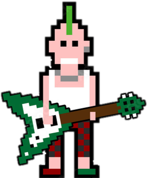
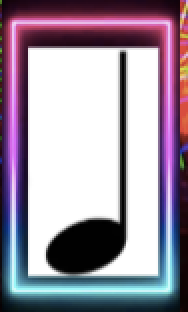

# BEAT HOP

## Game Design Document

---

##### _Creators: Álvaro García, Diego Araque, Marco Torres, Salomon Dabbah_

##

## Index

---

1. [Index](#index)
2. [Game Design](#game-design)
   1. [Summary](#summary)
   2. [Gameplay](#gameplay)
   3. [Mindset](#mindset)
3. [Technical](#technical)
   1. [Screens](#screens)
   2. [Controls](#controls)
   3. [Mechanics](#mechanics)
4. [Level Design](#level-design)
   1. [Background Design](#background-design)
   2. [Game Flow](#game-flow)
5. [Development](#development)
   1. [Abstract Classes](#abstract-classes--components)
   2. [Derived Classes](#derived-classes--component-compositions)
6. [Graphics](#graphics)
   1. [Style Attributes](#style-attributes)
   2. [Graphics Needed](#graphics-needed)
7. [Sounds/Music](#soundsmusic)
   1. [Style Attributes](#style-attributes-1)
   2. [Sounds Needed](#sounds-needed)
   3. [Music Needed](#music-needed)
8. [Schedule](#schedule)

## Game Design

---

### _Summary_

Runner Game that teaches basic percussion concepts such as the tempo of each musical note. During this learning procces the player has fun and increases his knowledge in music.

### _Gameplay_

The player will have to overcome a series of obstacles by jumping (with the spacebar) to the rhythm of the song played in the background, notes will be displayed on the screen to help the user identify when the perfect time for each jump will be, and learn the duration value for each note.

### _Mindset_

We want to provoque a calm and enjoyable gaming environment by playing relaxing music in the background. Increasing the difficulty of each level will hopefully change the emotional state of the player, going from a chill and loose state to a fun and rapid feeling.

## Technical

---

### _Screens_

1. Title Screen
   1. Start Game (button)
2. Level Select
   1. HighScore
3. Game
   1. Game display
   2. Pause
      1. Resume
      2. Restart
      3. Return to Menu
   3. Next Level
4. End Credits

### _Controls_

During the game, the player will be able to jump with the keyboard's spacebar (hold for a long jump and tap for a short jump).

### _Mechanics_

##### Movement

The character can only jump by using the spacebar. If he is not on a rough surface, he will not be able to jump.

##### Lives

The player has 5 lives and loses 1 each time he touches an obstacle, when he loses all his lives the game is over.

##### Score

Depending on how many lives the player has after completing the level, the percentage will variate. For example passing a level with 4 lives will give 80%.

##### Story & Characters

There are 3 different characters (one for each level), their objective is to reach the finish line using their knowledge in music and percussion.

##### Background

Each level will have a different background, that will be somehow related to the genre of the music being played in the respective level. Such as having a more classic background for classical music, or a disco for party music, etc. That will give a sense of belonging to the song in its respective ambience.

## Level Design

---

### _Background Design_

1. The City
   1. Mood
      Chill, easy, calm
   2. Music
      Slow music to teach game rules and the basics of music tempo
   3. Character
      Basic Joe
   4. Background
       
      
       
2. Future

   1. Mood
      Challenging, exciting
   2. Music
      The music is going to be faster, more tempo obstacles will come.
   3. Character
      Punk Bill
   4. Background
       
      
       

3. Mars
   1. Mood
      Challenging, exciting, hard
   2. Music
      This last level will have the fastest music with a lot of tempo obstacles.
   3. Character
      Disco Joe
   4. Background
       
      
       

### _Game Flow_

Three levels will be developed. Once a level is completed, another level and character are unlocked, and once all three levels and characters are unlocked, the user will be able to choose wich level or characters he wants fron the main screen. The user will also be able to wither return to the main screen when he loses a game or play again.

##### Flow:

1. The player starts moving while some music is playing.
2. As the background changes, the player will encounter multiple objects with a musical tempo note inside that the player will need to jump acording the tempo. If the player touches an obstacle he will loose a life, on the other hand, if he only has 1 life he will have to restart the level.
3. If the player reaches the end with one or more lives, he wins and unlockes the next character and level, if he hasn't unlocked all of them already.

## Development

---

### _Abstract Classes / Components_

1. BasePhysics
   - Characters
     - Basic Jim
        
       
        
     - Disco Joe
        
       
        
     - Punk Bill
        
       
        
2. BaseObstacle
    
   
    
3. In-game Screens
   1. Playable interface
       
      
       
   2. Menu
   3. Pause Menu

### _Derived Classes / Component Compositions_

1. BasePlayer
   1. PlayerMain
   2. PlayerUnlockable
2. BaseEnemy
   1. EnemyWolf
   2. EnemyGoblin
   3. EnemyGuard (may drop key)
   4. EnemyGiantRat
   5. EnemyPrisoner
3. BaseObject
   1. ObjectRock (pick-up-able, throwable)
   2. ObjectChest (pick-up-able, throwable, spits gold coins with key)
   3. ObjectGoldCoin (cha-ching!)
   4. ObjectKey (pick-up-able, throwable)
4. BaseObstacle
   1. ObstacleWindow (destroyed with rock)
   2. ObstacleWall
   3. ObstacleGate (watches to see if certain buttons are pressed)
5. BaseInteractable
   1. InteractableButton

(example)

## Graphics

---

### _Style Attributes_

What kinds of colors will you be using? Do you have a limited palette to work with? A post-processed HSV map/image? Consistency is key for immersion.

What kind of graphic style are you going for? Cartoony? Pixel-y? Cute? How, specifically? Solid, thick outlines with flat hues? Non-black outlines with limited tints/shades? Emphasize smooth curvatures over sharp angles? Describe a set of general rules depicting your style here.

Well-designed feedback, both good (e.g. leveling up) and bad (e.g. being hit), are great for teaching the player how to play through trial and error, instead of scripting a lengthy tutorial. What kind of visual feedback are you going to use to let the player know they&#39;re interacting with something? That they \can\ interact with something?

### _Graphics Needed_

1. Characters
   1. Human-like
      1. Goblin (idle, walking, throwing)
      2. Guard (idle, walking, stabbing)
      3. Prisoner (walking, running)
   2. Other
      1. Wolf (idle, walking, running)
      2. Giant Rat (idle, scurrying)
2. Blocks
   1. Dirt
   2. Dirt/Grass
   3. Stone Block
   4. Stone Bricks
   5. Tiled Floor
   6. Weathered Stone Block
   7. Weathered Stone Bricks
3. Ambient
   1. Tall Grass
   2. Rodent (idle, scurrying)
   3. Torch
   4. Armored Suit
   5. Chains (matching Weathered Stone Bricks)
   6. Blood stains (matching Weathered Stone Bricks)
4. Other
   1. Chest
   2. Door (matching Stone Bricks)
   3. Gate
   4. Button (matching Weathered Stone Bricks)

(example)

## Sounds/Music

---

### _Style Attributes_

Again, consistency is key. Define that consistency here. What kind of instruments do you want to use in your music? Any particular tempo, key? Influences, genre? Mood?

Stylistically, what kind of sound effects are you looking for? Do you want to exaggerate actions with lengthy, cartoony sounds (e.g. mario&#39;s jump), or use just enough to let the player know something happened (e.g. mega man&#39;s landing)? Going for realism? You can use the music style as a bit of a reference too.

Remember, auditory feedback should stand out from the music and other sound effects so the player hears it well. Volume, panning, and frequency/pitch are all important aspects to consider in both music and sounds - so plan accordingly!

### _Sounds Needed_

1. Effects
   1. Soft Footsteps (dirt floor)
   2. Sharper Footsteps (stone floor)
   3. Soft Landing (low vertical velocity)
   4. Hard Landing (high vertical velocity)
   5. Glass Breaking
   6. Chest Opening
   7. Door Opening
2. Feedback
   1. Relieved &quot;Ahhhh!&quot; (health)
   2. Shocked &quot;Ooomph!&quot; (attacked)
   3. Happy chime (extra life)
   4. Sad chime (died)

(example)

### _Music Needed_

1. Slow-paced, nerve-racking &quot;forest&quot; track
2. Exciting &quot;castle&quot; track
3. Creepy, slow &quot;dungeon&quot; track
4. Happy ending credits track
5. Rick Astley&#39;s hit #1 single &quot;Never Gonna Give You Up&quot;

(example)

## Schedule

---

(define the main activities and the expected dates when they should be finished. This is only a reference, and can change as the project is developed)

1. develop base classes
   1. base entity
      1. base player
      2. base enemy
      3. base block
2. base app state
   1. game world
   2. menu world
3. develop player and basic block classes
   1. physics / collisions
4. find some smooth controls/physics
5. develop other derived classes
   1. blocks
      1. moving
      2. falling
      3. breaking
      4. cloud
   2. enemies
      1. soldier
      2. rat
      3. etc.
6. design levels
   1. introduce motion/jumping
   2. introduce throwing
   3. mind the pacing, let the player play between lessons
7. design sounds
8. design music

(example)
