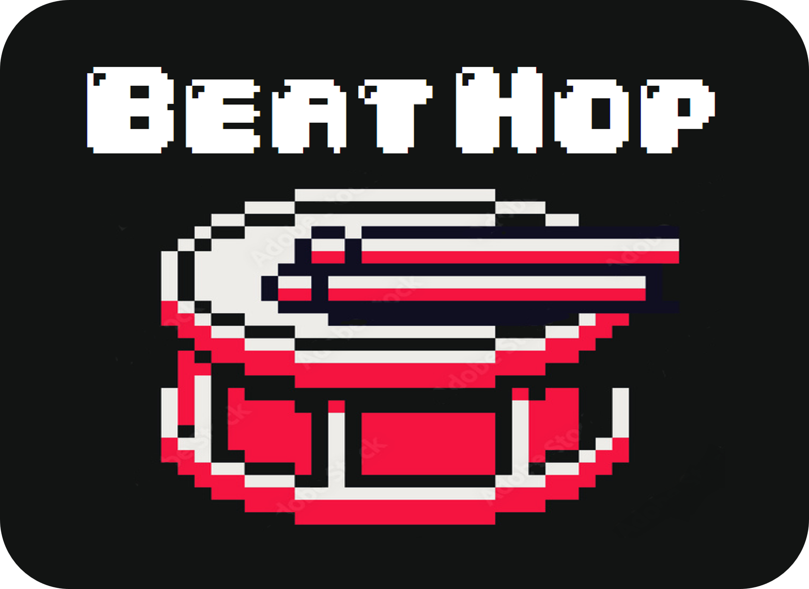
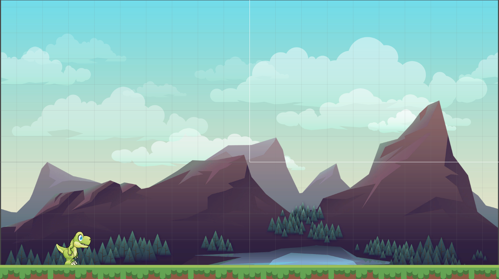
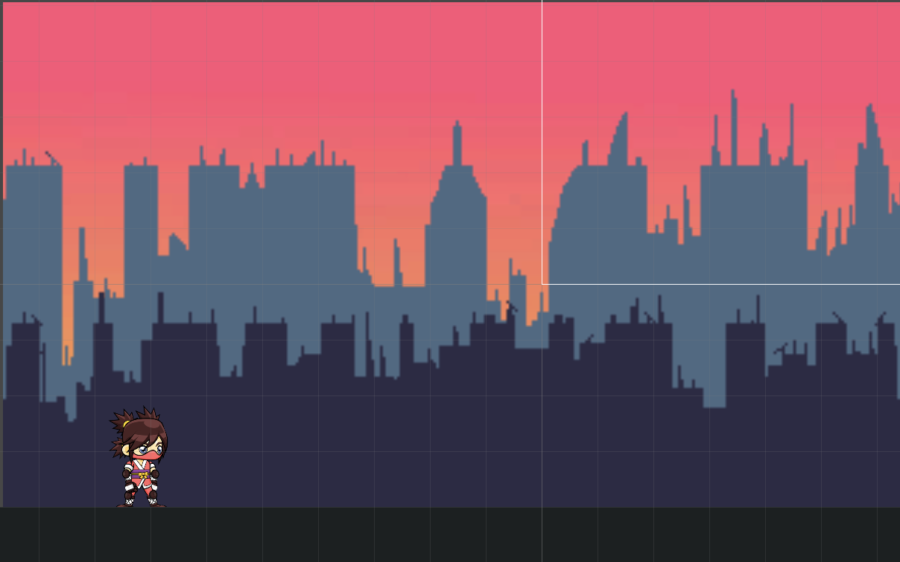
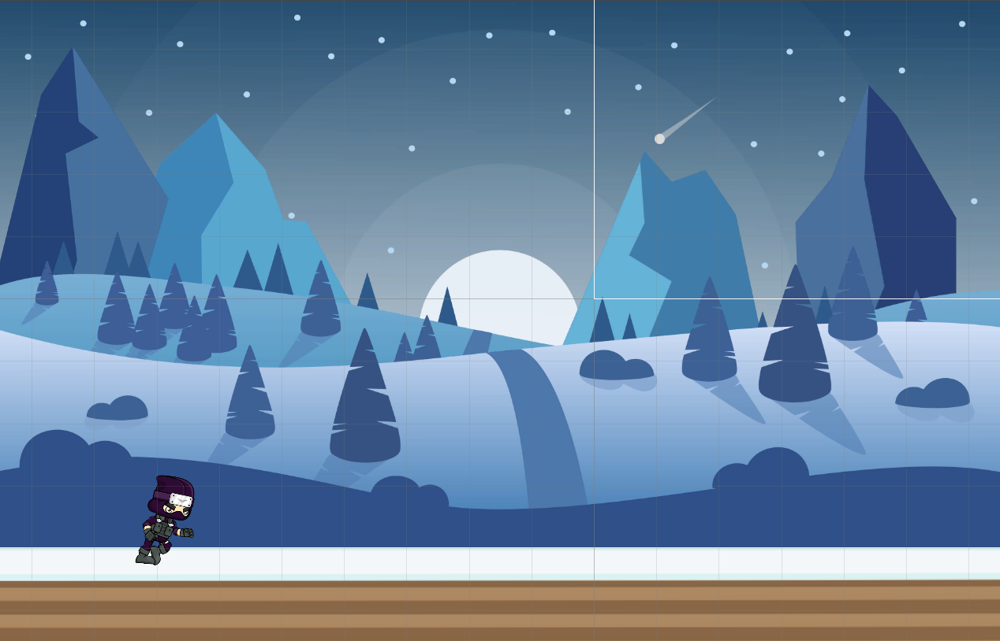

# BEAT HOP

## Game Design Document

---

##### _Creators: Álvaro García, Diego Araque, Marco Torres, Salomon Dabbah_

##

## Index

---

1. [Index](#index)
2. [Game Design](#game-design)
   1. [Summary](#summary)
   2. [Gameplay](#gameplay)
   3. [Mindset](#mindset)
3. [Technical](#technical)
   1. [Screens](#screens)
   2. [Controls](#controls)
   3. [Mechanics](#mechanics)
4. [Level Design](#level-design)
   1. [Background Design](#background-design)
   2. [Game Flow](#game-flow)
5. [Development](#development)
   1. [Abstract Classes](#abstract-classes--components)
   2. [Derived Classes](#derived-classes--component-compositions)
6. [Graphics](#graphics)
   1. [Style Attributes](#style-attributes)
   2. [Graphics Needed](#graphics-needed)
7. [Sounds/Music](#soundsmusic)
   1. [Style Attributes](#style-attributes-1)
   2. [Sounds Needed](#sounds-needed)
   3. [Music Needed](#music-needed)
8. [Schedule](#schedule)
9. [Video](#video)

## Game Design

---

### _Summary_

Runner Game that teaches basic percussion concepts such as the tempo of each musical note. During this learning procces the player has fun and increases his knowledge in music.

### _Gameplay_

The player will have to overcome a series of obstacles by jumping (with the spacebar) to the rhythm of the song played in the background, notes will be displayed on the screen to help the user identify when the perfect time for each jump will be, and learn the duration value for each note.

### _Mindset_

We want to provoque a calm and enjoyable gaming environment by playing relaxing music in the background. Increasing the difficulty of each level will hopefully change the emotional state of the player, going from a chill and loose state to a fun and rapid feeling.

## Technical

---

### _Screens_

1. Title Screen
   1. Start Game (button)
2. Level Select
   1. HighScore
3. Game
   1. Game display
   2. Pause
      1. Resume
      2. Restart
      3. Return to Menu
   3. Next Level
4. End Credits

### _Controls_

During the game, the player will be able to jump with the keyboard's spacebar (hold for a long jump and tap for a short jump).

### _Mechanics_

##### Movement

The character can only jump by using the spacebar. If he is not on a rough surface, he will not be able to jump.

##### Lives

The player has 5 lives and loses 1 each time he touches an obstacle, when he loses all his lives the game is over.

##### Score

Depending on how many lives the player has after completing the level, the percentage will variate. For example passing a level with 4 lives will give 80%.

##### Story & Characters

There are 3 different characters (one for each level), their objective is to reach the finish line using their knowledge in music and percussion.

##### Background

Each level will have a different background, that will be somehow related to the genre of the music being played in the respective level. Such as having a more classic background for classical music, or a disco for party music, etc. That will give a sense of belonging to the song in its respective ambience.

## Level Design

---

### _Background Design_

1. Mountains

   1. Mood
      Easy, exciting
   2. Music
      The music is slower, kind of a tutorial
   3. Character:
      Dinosaur
   4. Background
       
      
       

2. The City

   1. Mood
      Chill, challenging, calm
   2. Music
      Normal tempo, but some parts are faster
   3. Character:
      Chill Ninja
   4. Background
       
      
       

3. North Pole
   1. Mood
      Challenging, exciting, hard
   2. Music
      This last level will have the fastest music with a lot of tempo obstacles.
   3. Character:
      Ice Ninja
   4. Background
       
      
       

### _Game Flow_

Three levels will be developed. Once a level is completed, another level and character are unlocked, and once all three levels and characters are unlocked, the user will be able to choose wich level or characters he wants fron the main screen. The user will also be able to wither return to the main screen when he loses a game or play again.

##### Flow:

1. The player starts moving while some music is playing.
2. As the background changes, the player will encounter multiple objects with a musical tempo note inside that the player will need to jump. The type of the jump will depend on the note. If the player touches an obstacle he will loose a life, on the other hand, if he only has 1 life he will have to restart the level.
3. If the player reaches the end with one or more lives, he wins. Every level will be available, but players, especally beginners should play them in order.

## Development

---

### _Abstract Classes / Components_

1. BasePhysics
   - Characters
   - Lives
2. BaseObstacle
   - Geometric Figures
3. BaseInteractable
   - Pause Button
   - Play Button
   - Play Again
   - Go back to main menu
   - Select level

## Graphics

---

### _Style Attributes_

The main colors that we will be using are purple, yellow, orange, red, blue and black. Our pallete is limited but broad. The purpose of these colors is to asociate the game with relaxing and chill vibes.

 
"Mountains"
 

 
"North Pole"
 

 

>

Our graphics style is very pixely, the characters, backgrounds and assets are all retro/pixelated with thin outlines and very little emphasis on shadows, also our characters have very sharp angles to accentuate the retro appearance.

We will have visual feedback in the form of colors, every time the character gets hurt the game will display a red color over him. When a level is completed the game will display flashing colors asimilating fireworks to represent success and goal achievement.

### _Graphics Needed_

1. Characters
   1. Human-like
      1. Dinosaur (idle, jumping)
      2. Chill Ninja (idle, jumping)
      3. Ice ninja (idle, jumping)
2. Blocks
   1. Whole note (4 beats)
   2. Half note (2 beats)
   3. Quarter note (1 beat)
   4. Eighth note (1/2 beat)
   5. Whole rest (4 beat silence)
   6. Half rest (2 beat silence)
   7. Quarter rest (1 beat silence)
   8. Eighth rest (1/2 beat silence)
   9. Spike
3. Ambient
   1. Buildings
   2. Bridges
   3. Spaceships
   4. Hills
   5. Moons
   6. Neon signs
4. Other
   1. Ceiling
   2. Floor
   3. Goal Flag

## Sounds/Music

---

### _Style Attributes_

Each level will have a specific song depending on the difficulty of the level, but all songs will have a clear and notable drum or percussion instrument base, and the tempo obstacles will come in sync to that percussion base.

The songs in the levels will be popular songs for players to recognize and better understand the representation of the tempo notes in the song.

### _Sounds Needed_

1. Effects
   1. Short Jump (the avatar jumps a black note or shorter)
   2. Large Jump (the avatar jumps a white note or larger)
   3. Landing (the avatar lands from a jump)
   4. Obstacle Hit (the avatar hits an obstacle)
   5. Game Over (the avatar loses all lives)
   6. Win (the avatar wins the level)
2. Feedback
   1. Relieved &quot;Ahh!&quot; (the avatar hits an obstacle and lose a life)

### _Music Needed_

1. Level 1 Song: Slow and chill song based on drums or percussion instrument, with black and white note tempos. Maybe a reggae or jazz song.
2. Level 2 Song: Medium speed song with a percussion base of white, black and quarter notes. Maybe a classic rock song.
3. Level 3 Song: Fast and exciting song with all the music tempos and with a combination of them. Maybe a fast rock or metal song.

## Schedule

---

1. Learning what is necessary for the project.

   1.1 Learn agile methodologies - March 18 \
   1.2 Learn database fundamentals - April 1 \
   1.3 Learn videogame development fundamentals - March 4

2. Initial Game design and requirements \
   2.1 Meetings with percussive arts society - February 22 \
   2.2 Define the project requirements - February 25 \
   2.3 Definition of the game to be created - March 4
3. Asset sourcing \
   3.1 Set up the enviroment - March 4 \
   3.2 Get necessary backgrounds and sprites (graphics) - April 1 \
   3.3 Get the necessary music and sounds -April 1

4. Development of the game \
   4.1 Develop the game mechanics - April 8 \
   4.2 Develop the first level - April 15 \
   4.3 Develop the second level -April 15 \
   4.4 Develop the third level - April 22 \
   4.5 Develop the game menu - April 22

5. Creation of the database - April 15
6. Development of the website - April 15

7. Development of the final product - April 27

8. Product delivery and presentation - April 29

## Video

---

https://drive.google.com/file/d/18gXW9ZElMY9OKuvqXdxpOOBvrlVlsjEW/view?usp=sharing
